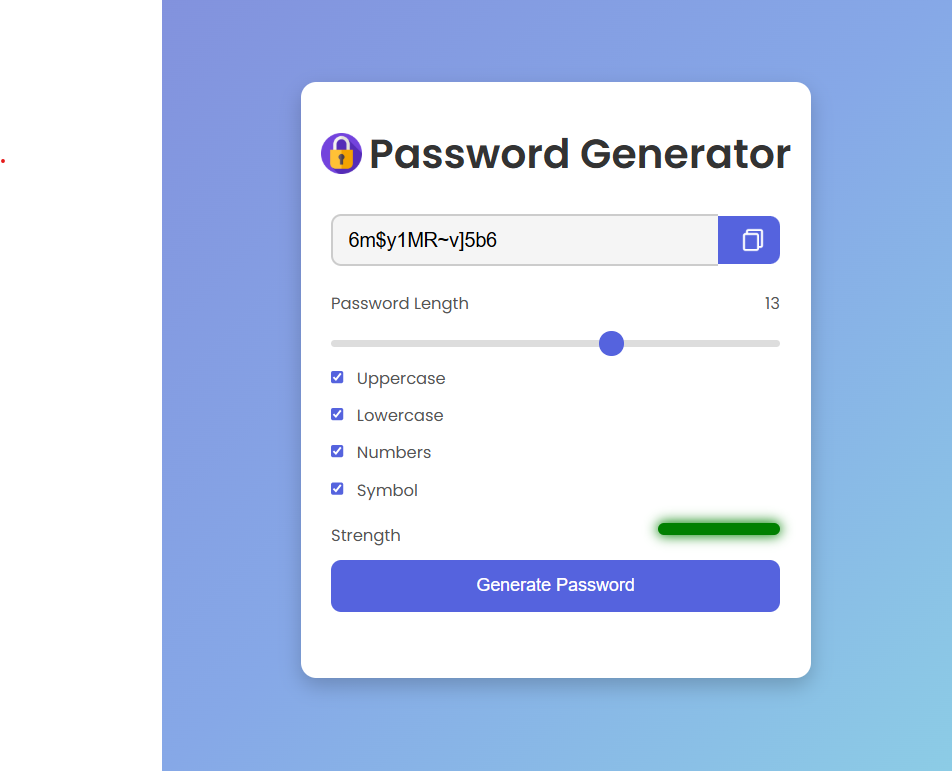

# 🔑 Password Generator  

A simple and stylish **Password Generator** built using **HTML, CSS, and JavaScript**.  
This tool allows users to generate **strong, customizable passwords** with options for **uppercase, lowercase, numbers, and symbols**.  

---

## 🚀 Features  

✔️ **Customizable Password Length** (1-20 characters)  
✔️ **Includes Uppercase, Lowercase, Numbers, and Symbols**  
✔️ **Password Strength Indicator** (Weak, Medium, Strong)  
✔️ **Copy to Clipboard Feature**  
✔️ **Interactive UI with Hover Animations**  
✔️ **Mobile Responsive Design**  

---

## 🎨 Demo Preview  

  

➡️ **Live Demo:** <a href="https://amancore.github.io/Password-Generator/" target="_blank">Click Here</a>

---

## 🛠️ Technologies Used  

- **HTML** – Structure  
- **CSS** – Styling & Animations  
- **JavaScript** – Functionality  

---

## 📂 Project Structure  

password-generator/  
│  
├── public/  
│   ├── padlock.png  
│   ├── copy.png  
│   ├── demo.png  
│  
├── index.html  
├── style.css  
├── script.js  
├── README.md  
